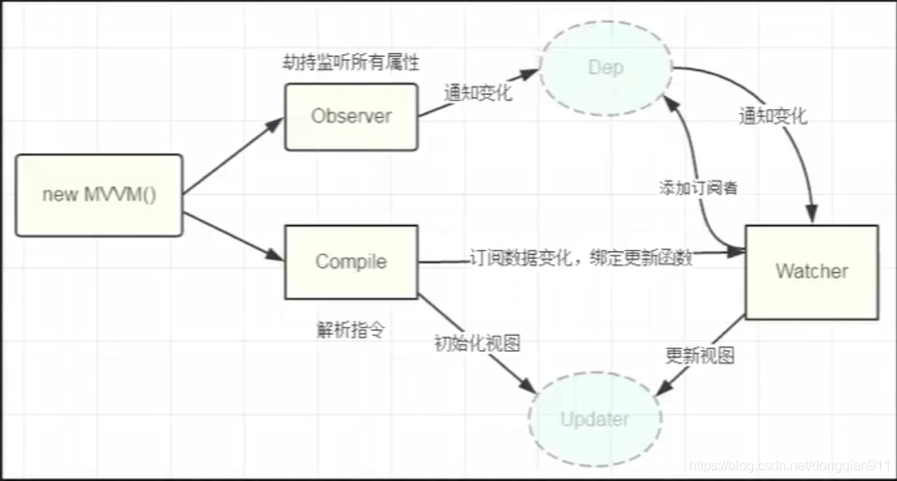

#### 1.什么是MVVM？和MVC有什么区别？什么又是MVP？[参考](https://zhuanlan.zhihu.com/p/27302766)
**MVC**
  - M（model）用于封装业务逻辑相关得数据以及对数据得处理方法
  - V（view）视图层，主要负责数据得展示
  - C（controller）响应机制封装在此，当用户和应用产生交互，控制器中得触发器开始工作

    - M和V之间使用了观察者模式，V先在M上注册，进入观察M，以便更新在M上发生改变得数据（M只是写了注册和通知V的方法，实际操作在C中）
    - V和C之间使用了策略模式，V中引入了C得实例来实现特定得响应策略

>*问题：每个事件都经过controller使得这层变得十分臃肿,而且V和C一般都是一一对应，这种紧密得连接让C得复用成了问题。*

**MVP**
  - P（Presenter），通过P来实现V和C的解耦，mvc中C只知道M的接口，因此没办法控制V的更新，MVP中，V层的接口暴露给P，因此我们可以在P层中将V和C的变化绑定在一起，以此来实现V和M的更新

**MVVM**
  - VM（ViewModel视图模型）：和mvp思路是相同的，只不过通过双向绑定将V和M的同步更新给自动化，当M变化VM就会自动更新，VM变化了V也会更新，这样就将Presenter中的工作给自动化了。

#### 2.什么是Virtual DOM？为什么 Virtual DOM 比原生 DOM 快？
**Virtual DOM**
>我们通过将模板经过一系列操作，生成一个与实际dom有着映射关系的一个ast树。

**为什么**
>减少了DOM的操作次数，从而避免了频繁的回流与重绘

#### 3.请说一下 vue2 响应式原理
```
- 简单来说: vue2 基于Object.defineProperty对数据进行劫持

- 从源码角度：使用initData对数据进行初始化操作，然后调用observe函数并实例化observer类，内部对所有属性进行了重写，并递归劫持了对象中的对象
```
*所以我们在使用vue的时候，如果数据层级过深要注意优化，如果不是响应式的就不要放在data中，要避免多次取值，还可以使用Object.freeze()来冻结对象*

#### 4."Vue"中怎么检测数组的变化？
**不使用Object.defineProperty劫持原因：**
> vue2并没有采用Object.defineProperty来进行劫持，因为修改索引的情况并不多。如果使用Object.defineProperty来进行劫持 会耗费大量性能，而是采用重写数组的变异方法来实现（函数劫持）

**实现：**
>对所有的数组都新增了了一个dep收集器进行依赖收集，然后对数组的7种方法进行函数劫持重写，实际里面还是调用了数组原来的方法，通过监听到7种方法的调用（如果是push、unshift、splice的添加操作，还要对其添加的属性进行劫持操作），最后通知页面更新。


#### 5.vue中如何进行依赖收集？


**dep + watcher**
```
- 首先得清楚dep与watcher是什么？dep 与 watcher 之间的关系

  - dep观察目标（每个属性都有一个dep） 与 watcher观察者（每一个组件都有一个watcher实例） 的关系

  - 一个组件中 有多个属性（n个属性形成一个视图） 一个watcher对应着n个dep

  - 一个属性对应着多个组件 1个dep对应着多个watcher 

  - dep 和 watcher 多对多的关系
```

**依赖收集**
>所谓的依赖收集（观察者模式），被观察者指代理的数据（使用dep去收集）,观察者（有3种，渲染watcher、计算属性watcher、watch watcher），一个watcher中可能对应着多个数据，watcher中还需要保存dep。

**实现**
>在属性初始化时通过给每个属性增加一个dep收集器，默认渲染页面的时候会进行依赖收集（会触发属性的get方法,因此也只会对页面上渲染的属性进行依赖收集），触发get的时候dep去记录对应的watcher，watcher同时也记录对应的dep，当数据变化，触发了属性的set方法（dep.notify方法）去执行属性dep记录的所有watcher


#### 6.如何理解 vue 中的编译原理
通过将template模板 变为 render函数

- template -> ast树
- 对语法树进行节点标记
- 将ast语法书生成render函数

>调用render生成虚拟节点，再通过update方法进行更新

#### 7.vue生命周期钩子是如何实现的？
>内部就是利用了一个发布订阅模式，将用户写的钩子维护成了一个个数组（主要靠的是mergeOptions方法）后续调用一次callHook将对应的钩子数组遍历执行

#### 8.为什么有些钩子是先子后父，有些是先父后子，组件是如何渲染的？
先父后子（beforeCreate 和 create）因为这两个钩子写在模板初始化之前

先子后父 （mount ）是因为在模板解析中如果遇到子组件会先解析完子组件，然后再去解析父组件


#### 9.`Vue`的生命周期方法有哪些？一般在哪一步发送请求及原因？
- beforeCreate 这里没有实现响应式数据，Vue3中不需要了 没用

- created 拿到的是响应式诗句（不涉及dom渲染）这个api可以在服务端渲染中使用

- beforeMount 没有实际价值

- mounted 可以获取$el

- beforeUpdate

- updated 更新前后

- activated 缓存组件

- deactivated 被 keep-alive 缓存的组件失活时调用

- beforeDestroy 实例销毁之前调用。在这一步，实例仍然完全可用

- destroyed 实例销毁后调用

- errorCaptured 在捕获一个来自后代组件的错误时被调用

> 一般最多的在mounted中发送请求（created不是比mouted早吗？代码是同步执行的，请求是异步的），在哪里发请求主要看你做什么事（如果请求完需要获取最新的dom元素，那么就在mouted中）

#### 10.`Vue.mixin`的使用场景和原理
场景
- 我们可以通过 Vue.mixin 来实现逻辑的复用，问题在于数据来源不明确，声明的时候可能会导致命名冲突。（Vue3采用的就compositionAPI解决的）

原理
- mixin核心就是合并属性（mergeOptions方法，内部采用了策略模式进行合并）全局的mixin，局部的mixin，针对不同的属性有不同的合并策略
#### 11.`Vue`组件data为什么必须是函数？
原因就在于针对根实例而言，组件是通过一个构造函数（Vue.extend）多次创建实例，如果是同一个对象的话那么数据会被相互影响，每个组件的数据源都是独立的，为了解决这一问题那就每次都调用data返回一个新对象

#### 12.`nextTick`原理是？
- nextTick 是一个用于异步执行回调函数的方法。它的原理是利用 JavaScript 中的事件循环机制，将回调函数推入到下一个微任务队列中，以确保在当前任务执行完成后执行回调。
- 总结来说，nextTick 的原理是通过将回调函数注册到微任务队列中，来确保在响应式更新队列执行完毕后，再执行这些回调函数，以便你在数据更改后立即获取到最新的 DOM 渲染结果或执行其他逻辑。这样可以避免在数据更改后立即获取 DOM 渲染结果时，获取到的仍然是更新之前的结果。

> nextTick内部采用了异步任务进行了包装（多个nextTick调用，只会执行一次，将回调函数推入队列中）最后在异步任务中批处理

*vue中的 nextTick没有直接采用某个api 而是采用优雅降级的方式，内部采用promise(ie 不兼容)、 MutationObserver(h5 的api)、  ie专项 setImmediate 、setTimeout*


#### 13.`computed` 和 `watch`的区别？
同：底层都会创建一个watcher（用法的区别computed定义的属性可以在模板中使用，watch不能）

异：
- computed 默认不会立即执行，只有取值的时候才会执行，内部会维护一个dirty属性，来控制依赖的是否发生变化，默认计算属性同步返回结果

- watch 默认用户会提供一个回调函数，数据变化了就调用这个回调，可控制是否立即执行

#### 14.`Vue.set`方法如何实现的？

已有属性：
  - 数组：直接调用splice方法（splice被重写过的）

  - 对象：直接赋值

新增属性：直接调用defineReactive方法，将属性转成响应式，然后调用ob.dep.notify()通知更新


#### 15.`Vue`为什么需要虚拟DOM
Vue 使用虚拟 DOM（Virtual DOM）作为中间层，是为了提高性能和优化视图更新的效率。虚拟 DOM 是一个轻量级的内存中表示，可以有效地代表真实 DOM 树的结构和状态。以下是为什么 Vue 需要虚拟 DOM 的一些原因：

1. **性能优化**：直接操作真实 DOM 会引起昂贵的重排（reflow）和重绘（repaint）操作，影响页面性能。虚拟 DOM 可以在内存中进行 DOM 操作，最终将所有修改一次性批量更新到真实 DOM，减少了实际 DOM 操作的次数，从而提高性能。

2. **批量更新**：虚拟 DOM 可以将多个状态变化合并为一个更新操作，从而减少实际的 DOM 操作次数。这有助于避免多次更新触发多次昂贵的重排和重绘操作，提高了性能。

3. **跨平台支持**：Vue 的虚拟 DOM 不仅可以用于浏览器环境，还可以用于其他环境，比如服务器端渲染（SSR）和移动应用开发。这样可以保持一致的开发体验，提高了代码的可复用性。

4. **优化 Diff 算法**：虚拟 DOM 可以通过优化的 Diff 算法，只对变化的部分进行更新，避免不必要的操作。这样可以最小化真实 DOM 的修改，提高性能。

5. **开发体验**：虚拟 DOM 可以将 DOM 操作从业务逻辑中抽离出来，使开发者更关注于数据和交互逻辑。同时，Vue 提供了声明式的模板语法，使视图逻辑更直观。

需要注意的是，虽然虚拟 DOM 在大多数情况下可以提高性能，但并不是适用于所有场景。在一些简单的应用中，直接操作原始的真实 DOM 可能更高效。Vue 在使用虚拟 DOM 时会在性能和开发体验之间做出权衡，使开发者能够根据实际需求选择最合适的方式。

#### 16.`Vue`中diff算法
**diff算法的特点就是平级比较，核心采用了双指针方式进行优化（4中命中）,最后递归比较**
  - 1.两个节点不是同一个节点，直接删除老的换上新的（没有对比）
  - 2.两个节点是同一个节点（判断节点tag和节点的key sameVnode方法） 比较两个节点的属性是否有差异（复用老的属性，将差异属性进行更新）
  - 3.节点比较完毕开始比较儿子
    - 如果老节点和新节点的儿子节点都存在（重点 updateChildren）
    - 老节点儿子不存在，新节点儿子存在直接挂载
    - 老节点儿子存在，新节点儿子不存在，直接清空

```javascript
diff算法核心就是4中命中优化(updateChildren)

  1.头大于尾 (从左往右比对 oldStartIndex：0 newStartIndex:0)
    (a) old: a b c d    (b) old:a b c 
        new: a b c          new:a b c d

  2.尾小于头 (从右往左比对)
    (a) old: a b c d   (b)  old:  b c d
        new:   b c d        new:a b c d
    
  3、4.首位交叉 (老->新 新->老) 这里是两种
    (a) old： a b c d  (b) old：a b c d
        new： b c d a      new：d a b c

  5.乱序比对
    d c b a 
    a b c d

- 4中命中，节点复用，
- 最后乱序比对 创建旧节点 字典库  用于判断是否存在相同节点 采取复用

流程
  - 在之前的更新中每次更新都会产生新的虚拟节点，通过新的虚拟节点生成真是节点，生成后替换掉老的节点
  - 在第一次渲染的时候我们会产生虚拟节点，第二次更新我们也会调用render方法产生虚拟节点，通过比对虚拟节点的差异，进行部分更新
```

#### 17.既然`Vue`通过数据劫持可以精准探测数据变化，为什么还需要虚拟DOM进行`diff`检测差异?
尽管 Vue 的数据劫持（通过 `Object.defineProperty`）可以实现精准的数据变化探测，但是直接操作真实的 DOM 具有一些性能上的问题，这些问题可以通过虚拟 DOM 和 Diff 算法来解决。

以下是为什么 Vue 需要虚拟 DOM 进行 Diff 检测差异的一些原因：

1. **减少 DOM 操作**：直接操作真实 DOM 是昂贵的操作，涉及到重排（reflow）和重绘（repaint）等性能消耗。通过虚拟 DOM，Vue 可以在内存中进行 DOM 操作，最终将所有变化一次性批量更新到真实 DOM，减少了实际 DOM 操作的次数。

2. **批量更新**：虚拟 DOM 允许 Vue 将多个数据变化合并为一个更新操作，从而减少了实际的 DOM 操作次数。这有助于避免多次更新触发多次昂贵的重排和重绘操作，提高了性能。

3. **优化 Diff 算法**：虚拟 DOM 使用 Diff 算法来比较新旧虚拟 DOM 树之间的差异，并仅对差异进行更新。这样可以最小化真实 DOM 的修改，进一步提高性能。

4. **跨平台支持**：Vue 的虚拟 DOM 不仅适用于浏览器环境，还可以用于其他环境，如服务器端渲染（SSR）和移动应用开发。这样可以保持一致的开发体验，提高代码的可复用性。

5. **组件层次化更新**：虚拟 DOM 允许 Vue 在组件层次化结构中进行差异比较和更新。这使得 Vue 可以对整个组件树进行高效的更新，而不仅仅是局部更新。

总结来说，虽然数据劫持可以精确探测数据变化，但是直接操作真实 DOM 会带来性能问题。虚拟 DOM 和 Diff 算法的引入可以有效地优化 DOM 操作，提高性能，同时保持开发的便利性和可维护性。这种权衡使得 Vue 在性能和开发体验之间取得了良好的平衡。

#### 18.请说明Vue中`key`的作用和原理，谈谈你对它的理解
- 节点识别
- 节点复用
- 优化更新

`key`是一种标识，用于唯一的标识每个节点，帮助Vue在diff比较时，更加精准比对新旧节点，通过合理设置`key`，可以优化性能。不推荐使用索引作为`key`

>栗子：动态列表频繁的插入删除，如果使用索引作为`key`，删除第二条数据，之后的数据的索引都会改变， 那么会导致diff算法认为新旧节点不一致，从而造成不必要的节点销毁和重新创建。

#### 19.谈一谈对`Vue`组件化的理解
Vue 的组件化是一种用于构建用户界面的开发模式，它将界面拆分为多个独立的、可复用的组件，每个组件都具有自己的状态、模板和逻辑。组件化使得前端开发更加模块化、可维护性更高，同时也提高了代码的复用性和开发效率。

以下是我对 Vue 组件化的理解：

1. **独立性和复用性**：Vue 组件是独立的功能单元，每个组件都包含了自己的数据、模板和行为。这种独立性使得组件可以在不同的项目中进行复用，从而加速开发过程，减少重复劳动。

2. **模块化开发**：组件化鼓励开发者将界面划分为多个小模块，每个模块专注于一个特定的功能。这种模块化开发方式使得项目更易于理解和维护，同时也方便团队合作，因为不同的开发者可以专注于不同的组件。

3. **单文件组件**：Vue 支持使用单文件组件（.vue 文件）来定义组件。单文件组件将模板、样式和逻辑放在同一个文件中，使得组件的结构更清晰，更易于管理。

4. **抽象和封装**：通过组件化，可以将界面抽象为更高层次的概念，使得界面逻辑和展示细节分离。这样可以更好地实现逻辑的复用和封装，同时也提高了代码的可测试性。

总之，Vue 的组件化是一种强大的开发模式，它使前端开发更加模块化、可维护性更高，同时也提高了代码的复用性和开发效率。通过将界面划分为独立的组件，开发者可以更轻松地构建复杂的用户界面，并在不同的项目中实现组件的复用。

*Vue中怎么处理组件：1.Vue.extend(组件核心 组件的创建都会使用)根据用户传入的对象生成一个组件的构造函数 2.根据组件产生对应的虚拟节点 3.组件初始化 将我们的虚拟节点转化成真实节点，并挂载（组件的init方法）*

#### 20.`Vue`的组件实现核心
Vue 组件可以通过多种方式来创建，以下是几种常见的创建方式：
1.**components**通过此方式建立的组件，内部默认会调用extend方法
```
Vue.component('my-component', {});
```
2. **通过 Vue.extend方法创建一个组件构造器，然后可以通过实例化构造器来创建组件实例。**
```javascript
const Sub = Vue.extend({});
// 创建组件实例
new Sub().$mount('#app');
```
>无论使用哪种方式创建组件，都需要提供组件的选项，包括模板、数据、方法、生命周期钩子等。Vue 组件的不同创建方式可以根据项目需求和组件复用程度来选择。

核心：
- 1.创建extend函数（所有组件的实现都是通过这个方法），对传入的参数进行合并（mergeOptions），建立组件的父子关系

- 2.创建真实节点时，进行判断区分是组件还是html标签，createComponent(vnode)。

- 3.如果是组件走mount挂载流程，也就是dom解析渲染流程

#### 21.组件的渲染流程
- 1.创建组件实例，组件内部数据初始化

- 2.模板解析（对模板进行编译  模板转换成ast语法树 将ast语法树转换成render函数）

- 3.render创建虚拟节点

- 4.update创建真实节点，如果是组件，执行组件init方法，获取到对应的组件，并调用$mount()，走解析dom流程（此处是解析虚拟dom，解析完成后挂载到父节点上）

#### 22.`Vue`组件更新流程

#### 23.异步组件原理

#### 24.函数组件的优势及原理
函数式组件（也称为无状态组件或函数组件）是在 Vue 2.3 版本中引入的一种组件定义方式。它与传统的基于类的组件（Class-based Components）相比，具有一些优势和特点。以下是函数式组件的优势和原理：

**优势：**

1. **性能优化：** 函数式组件相对于类组件具有更轻量的性能开销。因为它们没有实例状态（data、computed、watch 等），所以在不需要响应式功能的情况下，渲染和更新过程更加高效。

2. **简洁明了：** 函数式组件的定义方式更为简洁，只需一个函数来描述组件的渲染逻辑，不需要额外的实例属性和方法。

3. **适合纯展示组件：** 当一个组件只负责展示数据，不需要内部状态管理和生命周期钩子时，函数式组件是一个很好的选择，可以降低复杂性。

**原理：**

- 函数式组件的原理涉及到 Vue 编译器的优化和函数调用。在编译阶段，Vue 的编译器将函数式组件的模板编译成渲染函数。函数式组件的渲染函数返回的是一个 VNode（虚拟 DOM 节点），它描述了组件的结构和属性。

- 函数式组件通常采用一个接收 `props` 参数的函数来定义，该函数会返回一个 VNode。这个函数接受的参数包括 `props`、`slots`、`attrs` 等，它们都是响应式的，并且可以在函数中使用。

- 在组件渲染的过程中，Vue 会调用函数式组件的渲染函数，生成 VNode，并最终将 VNode 转换为实际的 DOM 元素。

- 需要注意的是，虽然函数式组件没有内部状态和生命周期钩子，但它们可以通过依赖注入（Provide / Inject）来共享数据，以及通过自定义指令和函数参数来实现更复杂的逻辑。

总结起来，函数式组件通过函数调用来定义组件的渲染逻辑，没有内部状态，适用于纯展示组件，并且在性能和简洁性方面具有优势。
#### 25.vue组件间传值的方式及之间区别
1. **props 和 $emit：**
   - `props` 用于从父组件向子组件传递数据，通过属性的方式。
   - `$emit` 用于从子组件向父组件触发自定义事件，父组件通过监听这些事件来接收数据。

2. **$children 和 $parent：**
   - `$children` 属性是一个数组，包含了当前组件的所有子组件实例。
   - `$parent` 属性指向当前组件的父组件实例。

3. **ref 和 refs：**
   - `ref` 是在组件内部使用的，可以为元素或子组件添加引用标识。
   - `refs` 是在父组件中使用的，可以通过引用标识来访问子组件或 DOM 元素。

4. **provide 和 inject：**
   - `provide` 在祖先组件中提供数据，并通过 `inject` 在子孙组件中注入数据。
   - 可以实现跨层级的传递数据，但容易造成代码的耦合性。

5. **$attrs 和 $listeners：**
   - `$attrs` 包含了父组件传递给子组件但子组件没有明确声明为 props 的属性。
   - `$listeners` 包含了父组件在子组件上绑定的所有事件。

6. **eventBus 全局事件总线：**
   - 使用一个独立的 Vue 实例作为事件中心，通过 `$emit` 发送事件，然后使用 `$on` 监听事件来实现组件间通信。
   - 可以在任意组件间通信，但容易导致难以维护的全局状态。

#### 26.v-if和v-for 哪个优先级更高？

#### 27.v-if、v-model、v-for实现原理

#### 28.`Vue`中slot是如何实现的？什么时候使用它？

#### 29.`Vue.use`是干什么的？原理是什么？

#### 30.`Vue`的事件修饰符有哪些？其原理是什么？

#### 31.Vue中.sync修饰符的作用，用法及实现原理？

#### 32.如何理解自定义指令

#### 33.`keep-alive`平时在哪里使用？原理是？

#### 34.组件中写name选项有哪些好处及作用？


