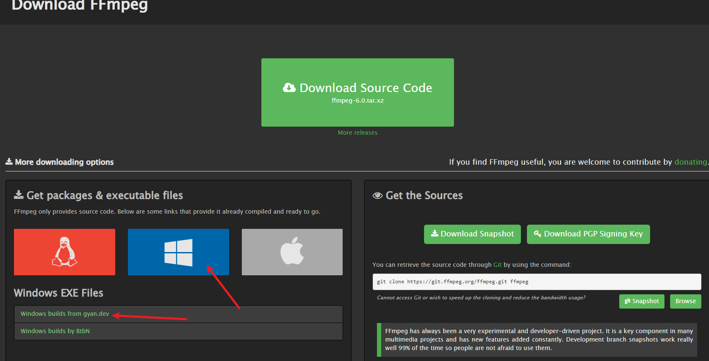
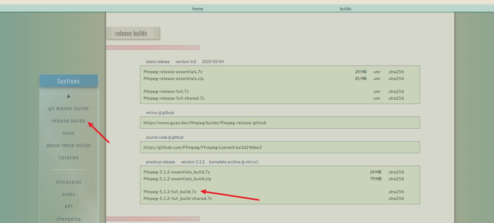
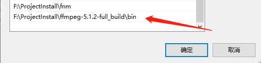
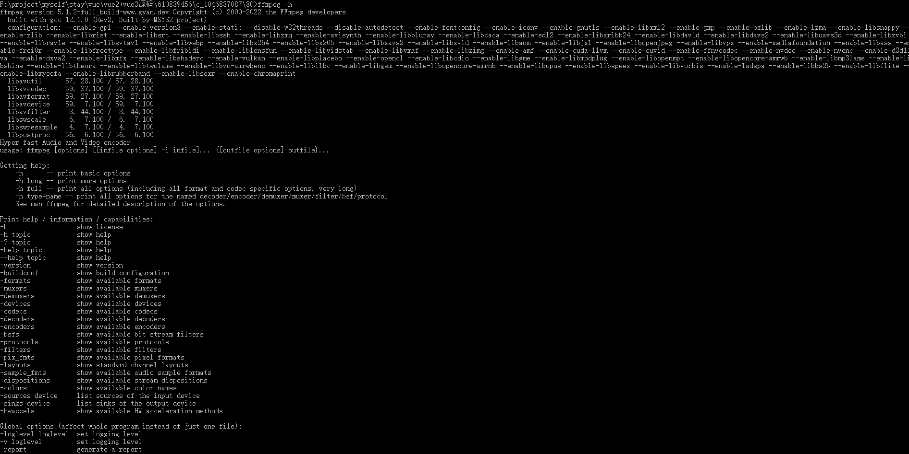

### ffmpeg 合并video.m4s与audio.m4s为mp4文件

##### 1.下载 https://ffmpeg.org/download.html





##### 2.ffmpeg安装包下载成功后，解压至电脑某个路径，复制此文件下bin文件的路径，配置环境变量
###### 栗:我存放的目录 F:\ProjectInstall\ffmpeg-5.1.2-full_build\bin


##### 3.检验是否安装成功
###### ffmpeg -h  若命令框有内容输出则ffmpeg安装成功且设置成功


##### 4.开始无损合并
###### 将手机缓存的video.m4s与audio.m4s文件拷贝到电脑 ，放在同一目录
###### 在文件夹目录栏直接输入cmd  回车即可打开cmd窗口
```
ffmpeg -i video.m4s -i audio.m4s -codec copy output.mp4
```

